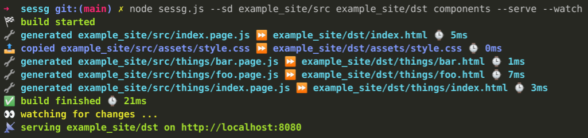
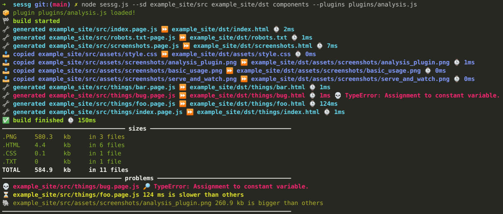

# sessg

Simple Extendable Static Site Generator

## Why another static site generator?

1. I wanted to build one.
2. ...
3. I thought I'd share it.
4. Maybe you end up liking it.
5. Also it's less than 200 lines of code with no dependencies for basic usage. So you can simply add it to your repository and will get one of the fastest build time on netlify and co.

## Idea

The basic idea behind sessg is borrowed from [ijmccallum/Mini-Site-Generator](https://github.com/ijmccallum/Mini-Site-Generator) namely that you write your site components as JavaScript modules. Which looks like this:

```
const layout = require("./components/layout.js");

module.exports = function(){
  return layout(html`
    <header>
      <h1>I am the home page!</h1>
    </header>
  `);
}
```

Notice the html template literal which allows VSCode extensions such as [lit-html](https://marketplace.visualstudio.com/items?itemName=bierner.lit-html) to properly highlight your html code inside the JavaScript template string. This way it doesn't look too ugly and allows you to use the full power of JavaScript to build your pages. No need to learn ugly template languages that are always limited in some way or another!

## Usage

**Example site**

To build the example site run `node sessg.js --sd example_site/src example_site/dst components`

**Minimal example:**

`node sessg.js --sd <src> <dst>`

`node sessg.js --sd ./site ./dist`

Where `src` is your source path and `dst` is your destination path. 

**Simple example:**

`node sessg.js --sd <src> <dst> <skip1> <skip2> --sd <src2> <dst2>`

`node sessg.js --sd ./site ./dist components/helpers components/utils --sd ./landing ./landing-dist`

As you can see you can provide the `--sd` argument multiple times. It always takes one `src` and one `dst` path. Optionally you can skip paths inside `src` by providing additional paths after `dst`.

**All options example:**

Please note that for the `--watch` argument you need to have [yuanchuan/node-watch] installed and for `--serve` you need [cloudhead/node-static].

`node sessg.js --sd <src> <dst> <skip1> <skip2> --sd <src2> <dst2> --rmd --watch --serve <port:default 8080> --plugins <plugin1> <plugin2>`

`node sessg.js --sd ./site ./dist components/helpers components/utils --sd ./landing ./landing-dist --rmd --watch --serve 9090 --plugins plugins/analysis plugins/example`

The additional arguments used are:

* `--rmd` removes the output directories every time before building
* `--watch` watches all src directories recursively for changes and triggers a rebuild
* `--serve [port]` serves the dst folders locally, incrementing the port for each dst
* `--plugins path [path...]` loads one or more plugins (more on that in the plugin section)

## Filenames & Generating

The filename logic is pretty simple:

* If a file ends with `.page.js` it goes through the generator. `example.page.js` becomes `example.html`.
* If you need a different extension than `html`, name your file e.g. `sitemap.xml-page.js` and it becomes `sitemap.xml`.
* All other files, unless they're explicitely excluded, are simply copied.

## Plugin System

I decided to add a simple plugin system that allows you to hook into several events of the static site generation process.
This allows you for example to calculate metrics (as seen in the analysis plugin) or even change some of the behavior of sessg.
A very simple plugin looks like this:

```
function afterGenerate({file, output}){
  return html`${output}
  <!-- ${file} generated @${new Date().toISOString()}. ${output.length} characters -->
  `
}
module.exports = { afterGenerate }
```

This would simply append the string to each generated file.

The file [plugins/example.js] explains all available event hooks.

The file [plugins/analysis.js] is an example of a useful plugin.
It highlights files that are slow to generate or bigger than other files.
It also gives an overview of size by file extension.

Consider writing your own plugin and submitting a pull request!


## Screenshots

### Basic Usage


### Serve and Watch


### Analysis Plugin


## Contribute

If you would like to contribute to **sessg** you're more than welcome to!

* You can suggest *features*, report *bugs* via the issues.
* If you have built a plugin or fixed a bug or added a feature please open a pull request.
* If you used **sessg** to build a website please consider opening an issue. I'd love to list it here.